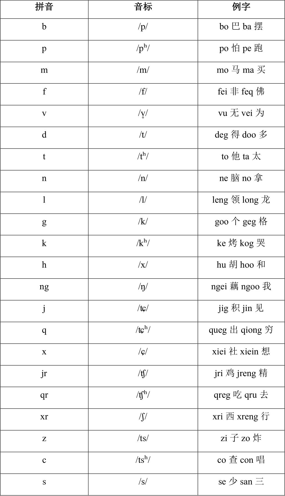
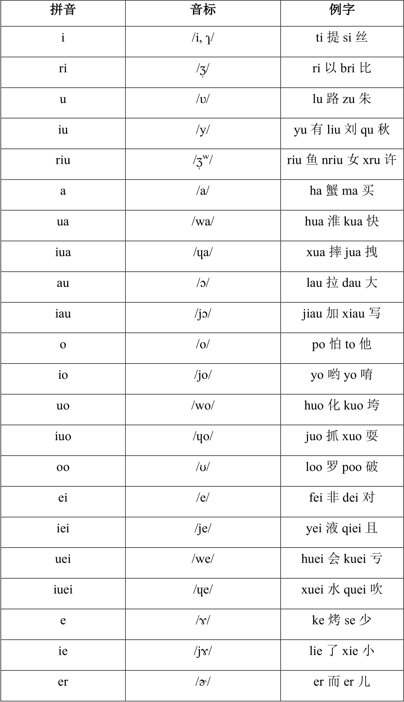
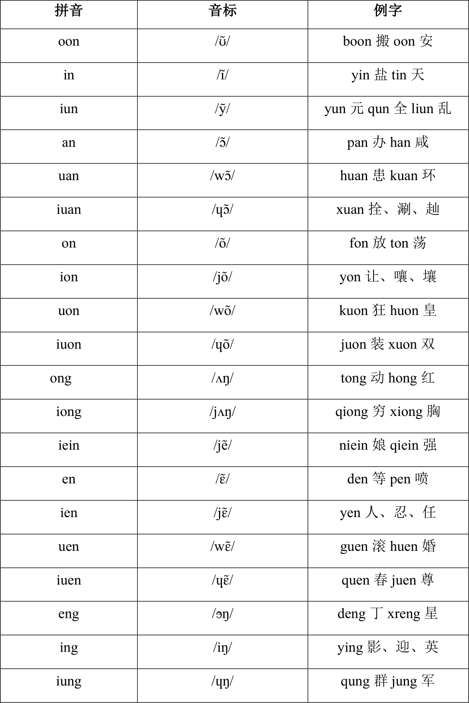
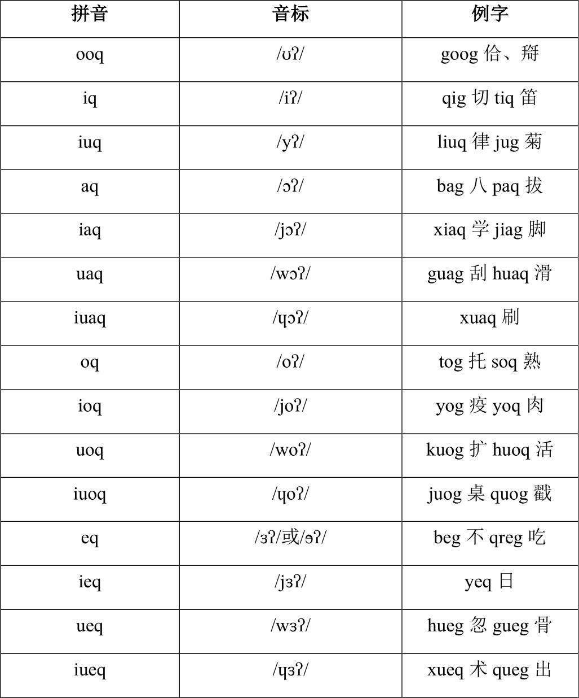

南通话输入法（南通方言网版）
============================

本输入法由陈佳平制作  码表正字由敖小平博士考证，取自敖小平博士的南通话输入法码表  本输入法使用陈佳平制作的南通话拼音  请参阅南通方言网相关信息，了解本输入法的具体使用方法：  <http://nantonghua.net/archives/7770>  

现将本输入法开源在此，供广大网友使用、参考。 

如何在PC，MacOS，iOS，Android，Linux 平台使用本输入法，请参见：  <https://laubonghaudoi.github.io/dialects/install/selection.html>

南通话拼音
----------

### 简表

南通方言网定制输入法的拼音方案实际上是《汉语拼音方案》的方言版本，熟悉汉语拼音方案就能很快熟悉此方言拼音方案。跟市面上成熟的拼音输入法一样，我们的定制输入法凡是输入过的字词会有记忆功能，以后输入多音节词或短语时可以只输入音节首字母便可，非常省事。另外，我们还设置了一定的拼写容错功能，使得本输入法方案比较灵活、友好。例如：ji、seng、mi、zing、ling等错误拼法也能出字，阴入和阳入字吃不准，收尾的字母g或q弄混也不要紧。需要详细了解我们拼音方案的，建议查看完整方案，可在此处或到南通方言网在线浏览或下载。

### 声母：

 
### 韵母：

#### 阴声韵：

 

#### 阳声韵：

 

#### 入声韵：

注：南通话入声韵分阴入和阳入，阴入为中调，以g表示，阳入为高调，以q表示。
